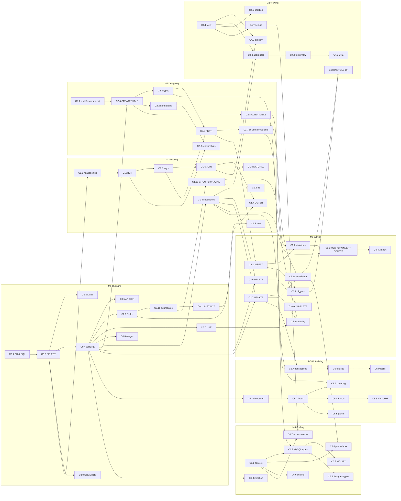

# Learning roadmap

## Dependency graph (concept level)

Arrows point from a concept to the concepts that need it. Concept IDs are defined in [knowledge_map.md](knowledge_map.md). Module *n* = CS50 SQL week *n* = `sources/lecture<n>.txt`.

## Recommended sequence

The lectures' own order (query → relate → design → write → view → optimize → scale) is a sound progression, and it is **kept**: module *n* = week *n*. Changes made:

1. **Within M0, the lecture order is kept.** It builds well: SELECT → filters → patterns → ranges → sorting → aggregates.
2. **In M1, GROUP BY/HAVING come last**, as in the lecture, because they combine aggregates (M0) with multi-table thinking. The lecture's two left-open tasks (M1-E17 title lookup, M1-E18 symmetric difference) are the module's challenges.
3. **In M2, constraints are grouped by kind**, not by when they were spoken. The lecture introduces NOT NULL/UNIQUE (L915-1022), detours into the CharlieCard redesign, and returns to CHECK/DEFAULT (L1231-1305). Here C2.7 holds all four.
4. **Relationships appear twice by design.** M1 *reads* them (ER diagrams, keys), and M2 *designs* them (CREATE TABLE with keys). C2.3 builds on C1.2.
5. **Soft deletion spans M3 → M4 → M6**, as in the sources: flag (lecture3) → view + INSTEAD OF triggers (lecture4) → stored procedure (lecture6).
6. **Two optional shortcuts.** Transactions (C5.7-C5.9) depend only on M2-M3, and SQL injection (C6.8) only on M0. If you work on a production app, study them early.

| Step | Module | Core concepts | Est. study time | Practice items | Gate to move on (mastery criteria) |
|---|---|---|---|---|---|
| 0 | [M0 Querying](modules/M0.md) | C0.1-C0.11 | 3-4 h | 18 + 4 debugging | M0-E05, M0-E13, M0-E17 without hints |
| 1 | [M1 Relating](modules/M1.md) | C1.1-C1.10 | 5-6 h | 23 + 9 debugging | The two lecture assignments (M1-E17, M1-E18); JOIN row counts predicted |
| 2 | [M2 Designing](modules/M2.md) | C2.1-C2.8 | 4-5 h | 13 + 4 debugging | You can write the full mbta schema from a blank file |
| 3 | [M3 Writing](modules/M3.md) | C3.1-C3.10 | 5-6 h | 15 + 6 debugging | votes cleanup and the sell/buy triggers from memory |
| 4 | [M4 Viewing](modules/M4.md) | C4.1-C4.8 | 4-5 h | 13 + 3 debugging | current_collections with all three INSTEAD OF triggers |
| 5 | [M5 Optimizing](modules/M5.md) | C5.1-C5.9 | 4-5 h | 12 + 4 debugging | Reach a covering-index plan for the Tom Hanks query; explain ACID with the bank example |
| 6 | [M6 Scaling](modules/M6.md) | C6.1-C6.8 | 4-6 h | 11 + 2 debugging | Translate mbta to MySQL and Postgres; explain sync vs async replication; demo injection vs a bound parameter |

## Spaced review plan

Use the review decks in [`../review/`](../review/) (or the **Review** tab in the app). After finishing a module, review it on this schedule, counting from the day you finish it:

| When | What |
|---|---|
| Day 1 (same day) | The module's quick-review and concept-check items |
| Day 3 | Predict-the-output items + 2 debugging items |
| Day 7 | Re-solve 3 exercises from the module **without hints** (pick ones you needed hints for) |
| Day 14 | Mixed deck: this module + all earlier modules |
| Day 30 | Write one full solution from scratch for the module's capstone (listed in each module page) |

The app's Review tab records your self-rating (Again / Hard / Good / Easy) for each card and schedules the next review: Again = 1 day, Hard = 3 days, Good = 7 days, Easy = 14 days. Each successful review doubles the interval.

## Gaps in the source material

These are **not** taught in the seven transcripts, so this system does not invent lessons for them. Learn them from another source when needed:
- **Window functions** (`OVER`, `PARTITION BY`, `RANK`, …): never mentioned. No window-function lessons or debugging items exist here.
- `CASE` expressions, `COALESCE`/`IFNULL`, string and date functions beyond `trim`/`upper`/`lower`/`ROUND`, `LIMIT … OFFSET`.
- Recursive CTEs, `UPSERT`/`ON CONFLICT`, `RETURNING`, JSON functions.
- Formal normal forms (1NF/2NF/3NF), which lecture2 L251-254 mentions only by name.
- Isolation *levels* (READ COMMITTED, SERIALIZABLE, …) and MVCC. Lecture 5 covers only SQLite's database-level locks.
- Stored-procedure control flow (IF / loops) and OUT parameters. Lecture 6 L1254-1277 only names them.
