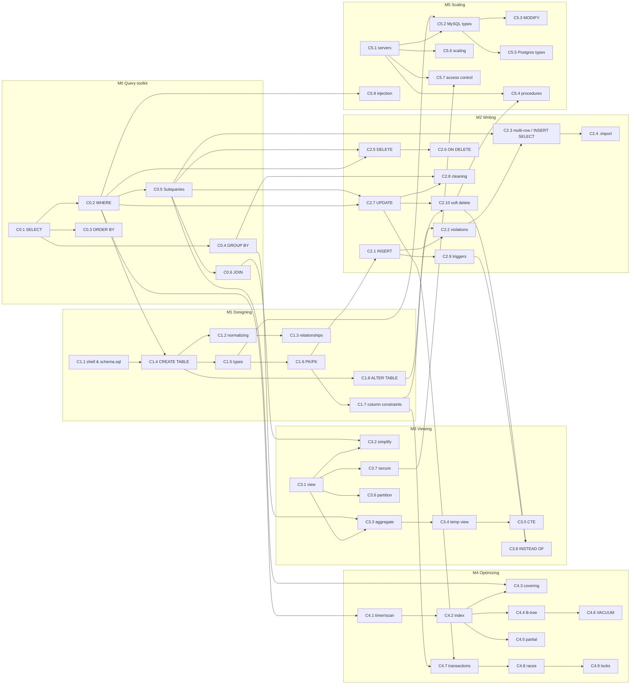

# Learning roadmap

## Dependency graph (concept level)

Arrows point from a concept to the concepts that need it. Concept IDs are defined in [knowledge_map.md](knowledge_map.md).

## Recommended sequence

The lectures' own order (design → write → view → optimize → scale) is already a sound progression, so it is **kept**. Five changes were made:

1. **Module 0 added in front.** All five lectures assume weeks 0-1 (SELECT, WHERE, GROUP BY, subqueries, JOIN). Without them, lecture 4's views and lecture 5's Tom Hanks query are unreadable. Every M0 exercise is built from a query that appears in these transcripts.
2. **In M1, constraints are grouped by kind**, not by when they were spoken. The lecture introduces NOT NULL/UNIQUE (L915-1022), detours into the CharlieCard redesign, and then returns to CHECK/DEFAULT (L1231-1305). Here C1.7 holds all four.
3. **In M2, "UPDATE for re-attribution" and "UPDATE for cleaning" are separate steps** (C2.7 → C2.8), because cleaning also needs GROUP BY and LIKE.
4. **Soft deletion spans M2 → M3 → M5**, as in the sources: flag (lecture3) → view + INSTEAD OF triggers (lecture4) → stored procedure (lecture6). The exercises follow this arc, so you revisit one design three times with new tools.
5. **Two optional shortcuts.** Transactions (C4.7-C4.9) depend only on M1-M2, and SQL injection (C5.8) depends only on M0. If you work with a production app, you can study them early.

| Step | Module | Core concepts | Est. study time | Exercises (source + generated) | Gate to move on (mastery criteria) |
|---|---|---|---|---|---|
| 0 | [M0 Query toolkit](modules/M0.md) | C0.1-C0.6 | 2-3 h | 10 + 6 debugging | All M0 practice exercises pass without the final hint |
| 1 | [M1 Designing](modules/M1.md) | C1.1-C1.8 | 4-5 h | 13 + 4 debugging | You can write the full mbta schema from a blank file |
| 2 | [M2 Writing](modules/M2.md) | C2.1-C2.10 | 5-6 h | 15 + 6 debugging | votes cleanup and the sell/buy triggers from memory |
| 3 | [M3 Viewing](modules/M3.md) | C3.1-C3.8 | 4-5 h | 13 + 3 debugging | current_collections with all three INSTEAD OF triggers |
| 4 | [M4 Optimizing](modules/M4.md) | C4.1-C4.9 | 4-5 h | 12 + 4 debugging | Reach a covering-index plan for the Tom Hanks query; explain ACID with the bank example |
| 5 | [M5 Scaling](modules/M5.md) | C5.1-C5.8 | 4-6 h | 11 + 2 debugging | Translate mbta to MySQL and Postgres; explain sync vs async replication; demo injection vs a bound parameter |

## Spaced review plan

Use the review decks in [`../review/`](../review/) (or the **Review** tab in the app). After finishing a module, review it on this schedule, counting from the day you finish it:

| When | What |
|---|---|
| Day 1 (same day) | The module's quick-review and concept-check items |
| Day 3 | Predict-the-output items + 2 debugging items |
| Day 7 | Re-solve 3 exercises from the module **without hints** (pick ones you needed hints for) |
| Day 14 | Mixed deck: this module + all earlier modules |
| Day 30 | Write one full solution from scratch for the module's capstone (listed in each module page) |

The app's Review tab records your self-rating (Again / Hard / Good / Easy) for each card and schedules the next review: Again = 1 day, Hard = 3 days, Good = 7 days, Easy = 14 days. Each successful review doubles the interval.

## Gaps in the source material

These are **not** taught in the five transcripts, so this system does not invent lessons for them. Learn them from another source when needed:
- Weeks 0-1 content as *teaching* (M0 is only a toolkit recap): LEFT/RIGHT/FULL OUTER JOIN, set operations other than the UNION in the injection demo, `CASE`, `HAVING`, `DISTINCT`, NULL handling in aggregates.
- **Window functions** (`OVER`, `PARTITION BY`, `RANK`, ...): never mentioned. No window-function lessons or debugging items exist here.
- Recursive CTEs, `UPSERT`/`ON CONFLICT`, `RETURNING`, JSON functions, date arithmetic functions.
- Formal normal forms (1NF/2NF/3NF), which lecture2 L251-254 mentions only by name.
- Isolation *levels* (READ COMMITTED, SERIALIZABLE, ...) and MVCC; lecture5 covers only SQLite's database-level locks.
- Stored-procedure control flow (IF / loops) and OUT parameters: lecture6 L1254-1277 only names them.
