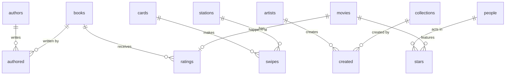

# Practice databases

Each dataset recreates one the lectures use. **Values the lecture states are preserved exactly**, and `tests/test_system.py::test_facts_from_the_lectures` checks them. Everything else is reconstructed or synthetic, and each `seed.sql` says which is which.

| Dataset | Used in | Tables | Preserved from the lectures | Synthetic / reconstructed |
|---|---|---|---|---|
| `longlist` | lecture4 (and lecture2 glimpse) | authors, books, authored, ratings | Real International Booker longlist titles 2018-2023; Fernanda Melchor = author 24 (Paradais, Hurricane Season); Han Kang = 31 → book 74 *The White Book*; *Minor Detail* = book 34 (2021); 13 books in 2023; slide averages 3.67 / 2.5 for books 1 / 2 | Other ids, two years with 12 of 13 titles, all other ratings (seeded random) |
| `mbta` | lecture2, lecture6 | cards, stations, swipes | Final lecture-2 schema; fare 2.40; real station names | Card ids and every swipe |
| `charlie` | lecture2 L147-199 | log | Every value of the first draft table (Charlie, Alice, Bob) | — |
| `mfa` | lecture3, lecture4, lecture6 | collections, artists, created | Titles, accession numbers, dates; Farmers = 1, Imaginative Landscape = 2; Li Yin = 1, Unidentified artist = 3; ON DELETE CASCADE | Artist 2 ("Placeholder Artist") and the attributions of items 3-4 |
| `votes` | lecture3 L1197-1452 | votes | 20 votes; the typo/space/case variants named in the lecture; final counts 6 (Farmers) and 5 (Imaginative) | Exact list and the 5/4 split of the other two titles |
| `rideshare` | lecture4, lecture6 | rides | Rows 1-2 (Peach, Mario) | Rows 3-6 |
| `movies` | lecture5 | people, movies, stars, ratings | Tom Hanks 158, Kristen Bell 68338, Toy Story 114709, Frozen 2294629, Cars 317219 (2006) | Size (19 movies, not 400k), other person ids, ratings/votes |
| `bank` | lecture5, lecture6 | accounts | Alice 10, Bob 20, Charlie 30; CHECK(balance >= 0) | — |

CSV files in `csv/` reproduce the lecture's imports: `mfa.csv` (with ids), `mfa_noid.csv` (without; note the blank date), and `votes.csv`.
`scaling/` holds the MySQL and PostgreSQL versions from lecture 6 ([scaling/README.md](scaling/README.md)).

## Build

```bash
python3 tools/build_db.py          # database/<name>.db for every dataset → sqlite3 database/mfa.db
python3 tools/build_db.py --big    # + database/movies_big.db (300k synthetic movies) for the timing lab
```
The trainers never touch these files. Every exercise runs on a fresh in-memory copy, with `PRAGMA foreign_keys = ON`.

## Relationships


